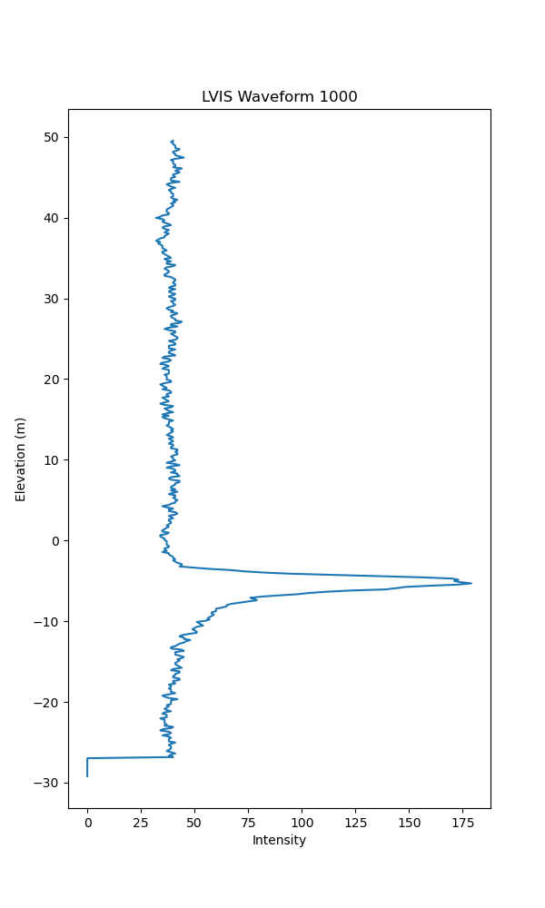
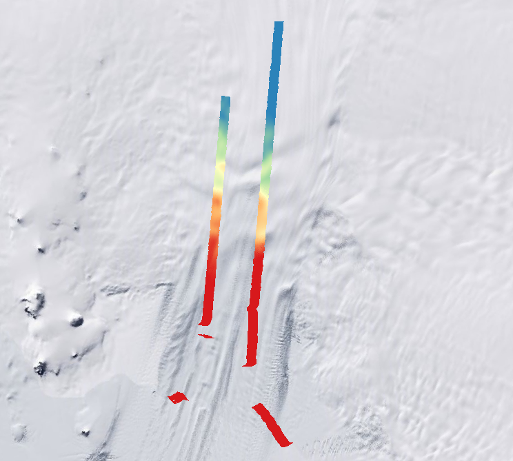
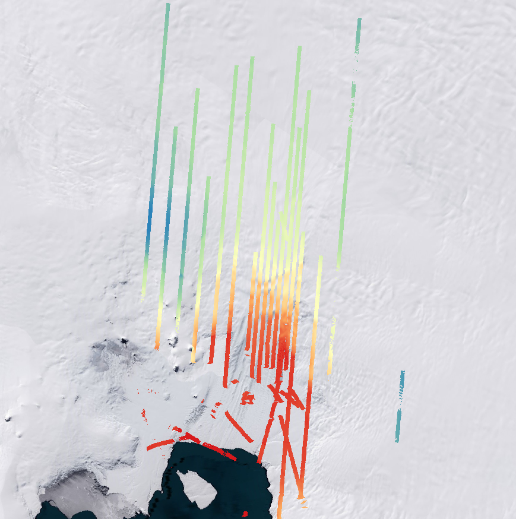
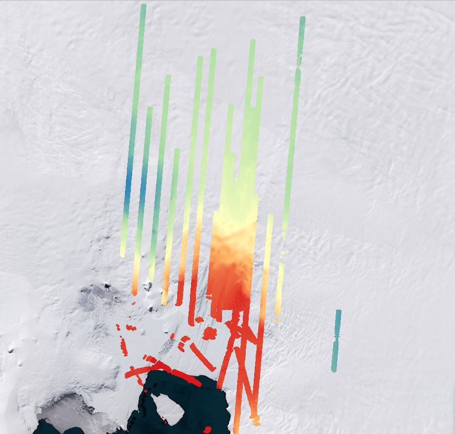
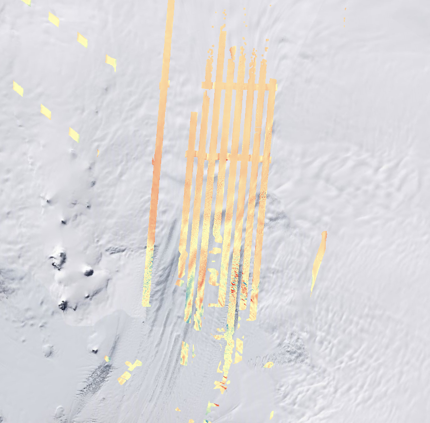

# 🌍 Pine Island Glacier LVIS DEM Processing (OOSA Final Assessment 2024)

This project processes NASA LVIS waveform LiDAR data to generate Digital Elevation Models (DEMs) for Pine Island Glacier (PIG) from 2009 and 2015, identify elevation changes, and estimate ice volume loss. The workflow includes waveform visualization, tiling, DEM generation, optional gap filling, and change detection.

---

## 📁 Project Structure

```
final-assessment-azraqoth/
├── additional/
│   ├── task1_plot_waveform.py
│   ├── task234_create_dem.py
│   ├── task5_calculate_DEM.py
│   ├── file_selection.py
│   ├── tile_processor.py
│   ├── lvis_dem_tools.py
│   └── data/
│       ├── bound2.geojson
│       ├── valid_2009_files.txt
│       └── valid_2015_files.txt
│
├── src/
│   ├── processLVIS.py
│   ├── lvisClass.py
│   ├── handleTiff.py
│   └── lvisExample.py
│
├── figures/
│   ├── task_1.png
│   ├── task_2.png
│   ├── task_3.png
│   ├── task_4.png
│   └── task_5.png
│
├── requirements.txt
└── README.md
```

---

## ⚙️ Setup

Install required packages:

```bash
pip install -r requirements.txt
```

---

## 🧪 File Selection

Before any DEM processing, generate the list of `.h5` files that intersect your AOI:

```bash
python additional/file_selection.py --folder additional/data
```

Creates `valid_2009_files.txt` or `valid_2015_files.txt` in the `data/` folder using `bound2.geojson` (EPSG:3031).

---

## 🛰 Task 1 – Plot LVIS Waveform

**Description**: Visualize waveform data from an individual LVIS shot to understand intensity patterns and locate ground returns.  
**Input**: `.h5` file, waveform index  
**Output**: `.png` plot of intensity vs. elevation

```bash
python additional/task1_plot_waveform.py additional/data/ILVIS1B_*.h5 1000 --output figures/task_1.png
```



---

## 🧱 Task 2 – DEM from a Single File (Tiled Output)

**Description**: Processes a single `.h5` file, generates elevation data, and outputs as multiple tiled GeoTIFFs with projection EPSG:3031.  
**Input**: One LVIS file, spatial resolution, number of tiles  
**Output**: Merged DEM raster for the selected file

```bash
python additional/task234_create_dem.py \
  --folder additional/data \
  --list valid_2015_files.txt \
  --test_files ILVIS1B_*.h5 \
  --res 50 \
  --tiles 20 \
  --output_dir output/output_tiles \
  --output output/task2.tif
```



---

## 🗺 Task 3 – Full DEM via Tiling and Merging

**Description**: Automatically tiles, processes, and merges all valid LVIS files into one complete DEM for the entire AOI.  
**Input**: List of valid `.h5` files from file selection step  
**Output**: Merged full-area DEM GeoTIFF

```bash
python additional/task234_create_dem.py \
  --folder additional/data \
  --list valid_2015_files.txt \
  --res 50 \
  --tiles 20 \
  --output_dir output/output_tiles \
  --output output/task3.tif
```



---

## 🧩 Task 4 – Gap-Filled DEM

**Description**: Fills missing or sparse regions using a mean filter applied over each tile’s 5×5 neighborhood.  
**Input**: Same as Task 3 with `--fill` flag  
**Output**: Smooth, gap-filled DEM ready for analysis

```bash
python additional/task234_create_dem.py \
  --folder additional/data \
  --list valid_2009_files.txt \
  --res 50 \
  --tiles 20 \
  --fill \
  --output_dir output/output_tiles \
  --output output/task4.tif
```



---

## 🧊 Task 5 – Elevation Change and Volume Loss

**Description**: Calculates elevation change between 2009 and 2015 DEMs and estimates total volume difference over the AOI.  
**Input**: Two DEMs (2009, 2015)  
**Output**: Elevation difference GeoTIFF and volume loss value in cubic meters

```bash
python additional/task5_calculate_DEM.py \
  --folder output \
  --output_diff output/task5_change.tif
```



---

## 🔧 CLI Options Summary

- `--folder`: Folder containing LVIS `.h5` files
- `--list`: Text file of valid filenames (e.g., `valid_2015_files.txt`)
- `--test_files`: Run only on selected `.h5` files
- `--res`: DEM resolution (in meters)
- `--tiles`: Number of tiles per row/column
- `--fill`: Apply mean filter for gap-filling
- `--output_dir`: Directory for intermediate tile GeoTIFFs
- `--output`: Final merged DEM filename
- `--output_diff`: Output elevation change raster (Task 5)


---

## 📝 License

Created for academic use in the 2024 OOSA final assessment.

